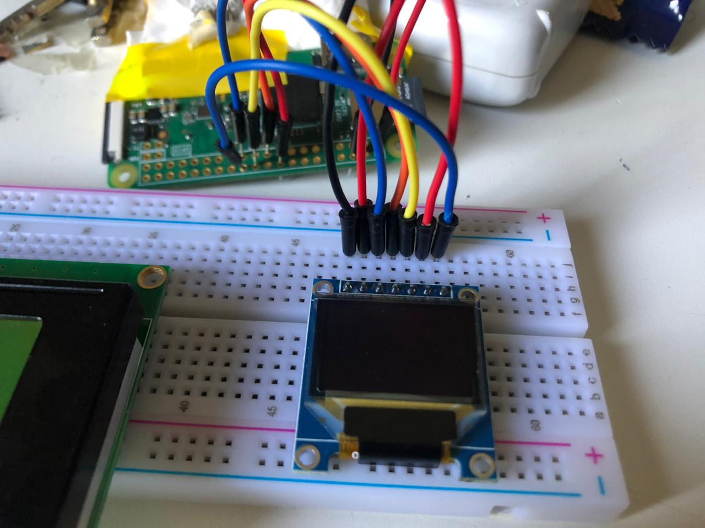
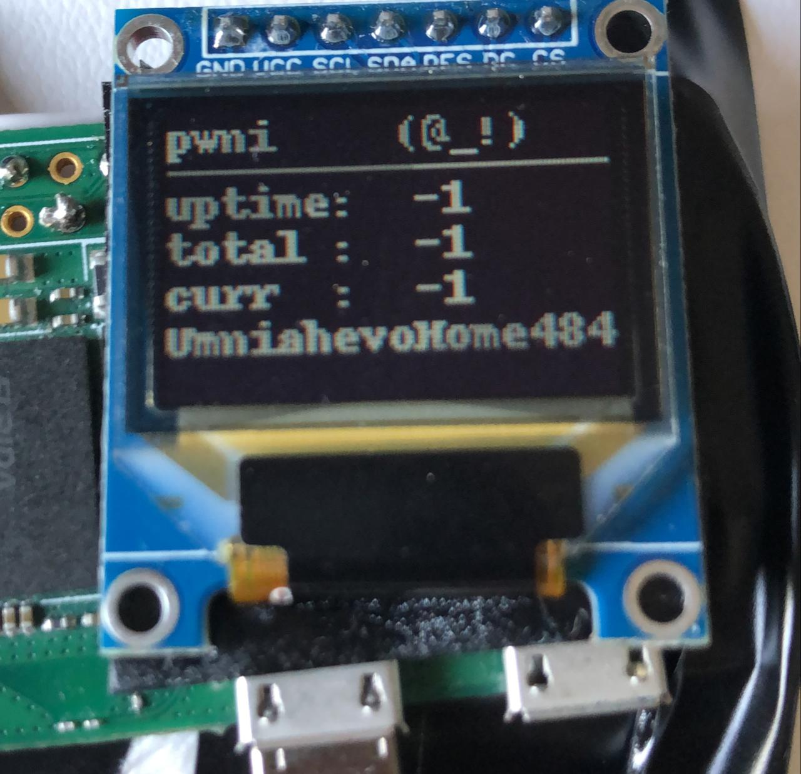
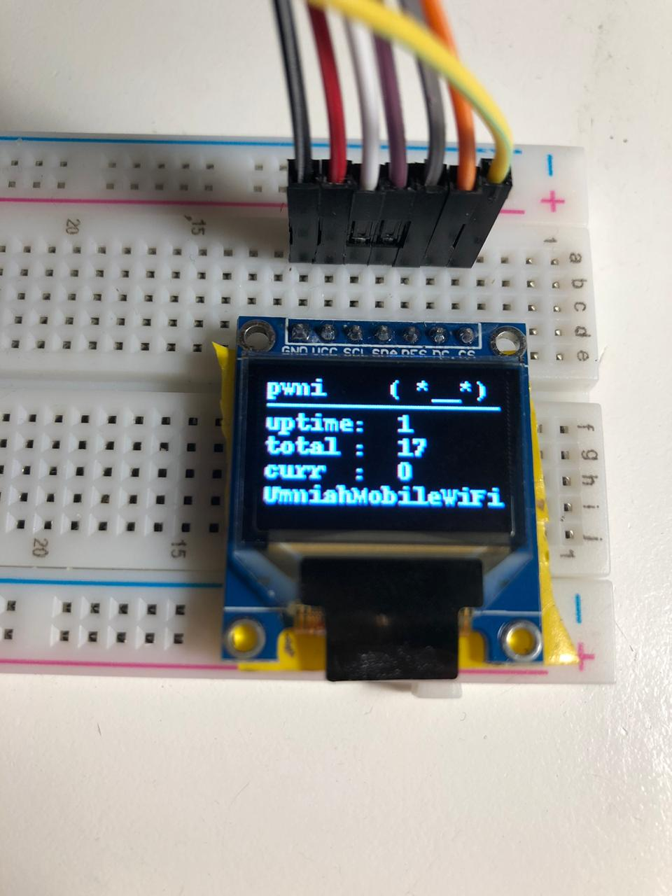
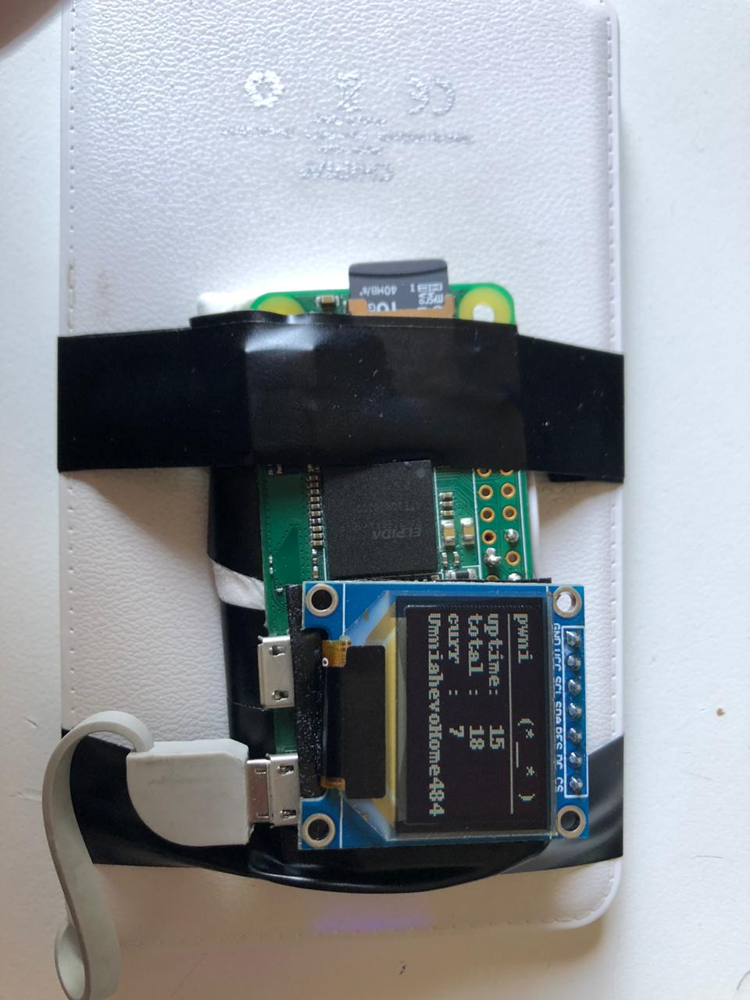

# Pwnaghotchi - SSD1331 display

### From their website :

Pwnagotchi is an A2C-based “AI” powered by bettercap and running on a Raspberry Pi Zero W that learns from its surrounding WiFi environment in order to maximize the crackable WPA key material it captures (either through passive sniffing or by performing deauthentication and association attacks).

for more information : [pwnagotchi](https://pwnagotchi.ai/)


### Steps :

##### Connecting the display to the raspberry pi

This blog show the process in great way

[OLED Display Library Setup for the Raspberry Pi featuring SSD1331 - bluetin.io](https://www.bluetin.io/displays/oled-display-raspberry-pi-ssd1331/)





##### Writing a script to work with pwnaghtchi

For that i use the mainly the [Pwnagotchi API](https://pwnagotchi.ai/api/) for that to retrieve  the information to display them on the screen 


So i wrote a simple python script get the information from the API and display them to the screen using the `luma` library  


copy the `ssd1331_display.py` from my github and insert it in `luma.examples/examples`


before running the script you need to change the permission in `/root` to make it readable by others because pwnaghotchi stores handshakes in that directory 

```bash
sudo chmod 755 /root
```


##### testing the script

to make sure that the script works correctly 

```bash
python3 /home/pi/luma.examples/examples/ssd1331_display.py -d ssd1331 -i spi --width 96 --height 64
```

if look like this that means it is working correctly 

    (-1) -> indicate that the pwnaghotchi in MANU mood  




##### Auto start the script

using crontab to automatically run the script on boot 

```bash
sudo crontab -e 
```

 add this line to the end 

```bash
@reboot python3 /home/pi/luma.examples/examples/ssd1331_display.py -d ssd1331 -i spi --width 96 --height 64 &
```

Now if you restart the pwnaghotchi in AUTO mood it should work 




##### Extra

the project is done now but you can soldering the connection between the display and the raspberry pi and attach a power-bank for using it outside 





